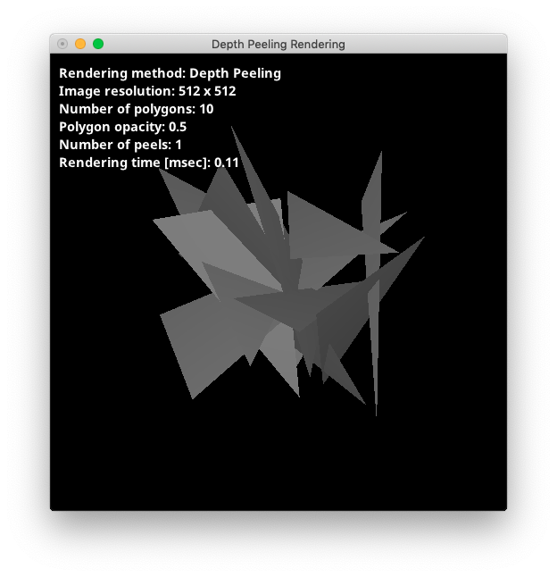
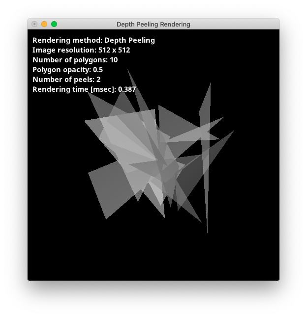
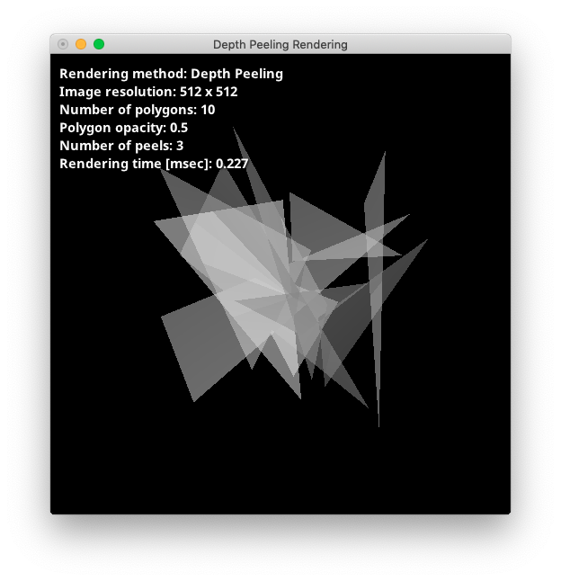
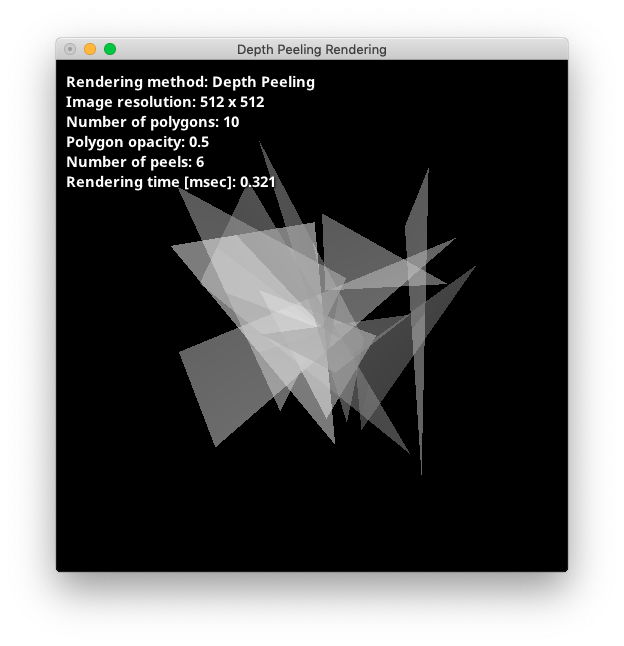
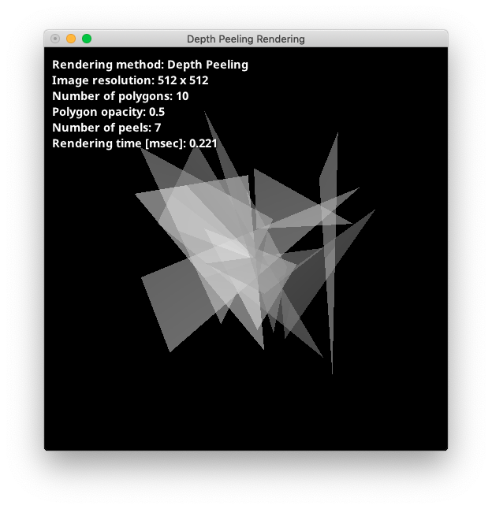
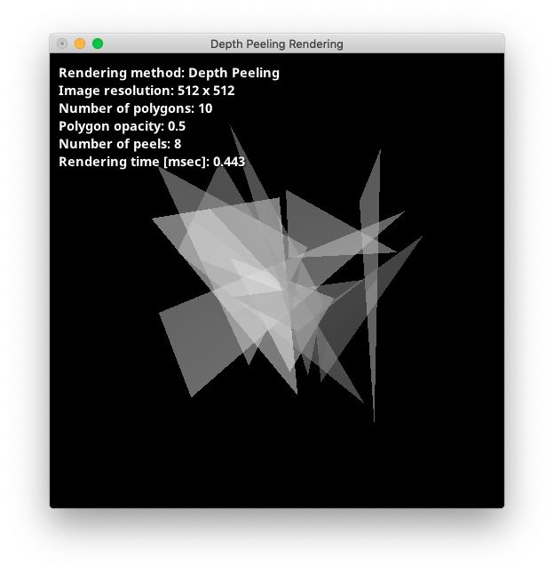
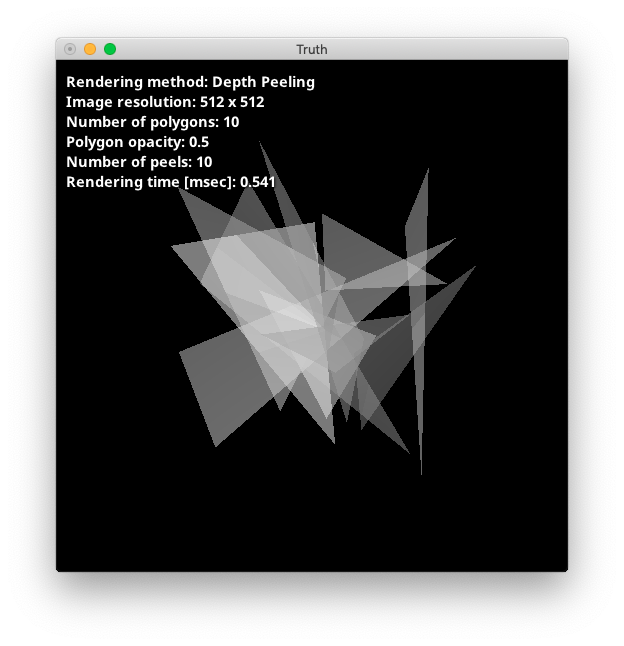

# Depth_Peeling

## Original Repository
- https://github.com/naohisas/DepthPeeling

## Usage

```
Usage: ./DepthPeeling [options]

Options:
-h          : Output help message.
-width      : Screen width. (defulat: 512)
-height     : Screen height. (defulat: 512)
-nrepeats   : Number of repetitions for IPBR. (defulat: 1)
-npeels     : Number of peels for DP. (defulat: 1)
-npolygons  : Number of polygons. (defulat: 10)
-opacity    : Opacity value for polygon object. (default: 0.5)
-color      : Color value for polygon object. (default: 0, 0, 0)
-background : Background color. (default: 255, 255, 255)
-offscreen  : Offscreen rendering [0:disable, 1:enable]. (default: 0)
```

## Visualization Results

|Layer-1|Layer-2|
|:-:|:-:|
|||

|Layer-3|Layer-4|
|:-:|:-:|
|||

|Layer-5|Layer-6|
|:-:|:-:|
|||

|Layer-7|Layer-8|
|:-:|:-:|
|||

|Layer-9|Layer-10|
|:-:|:-:|
|||